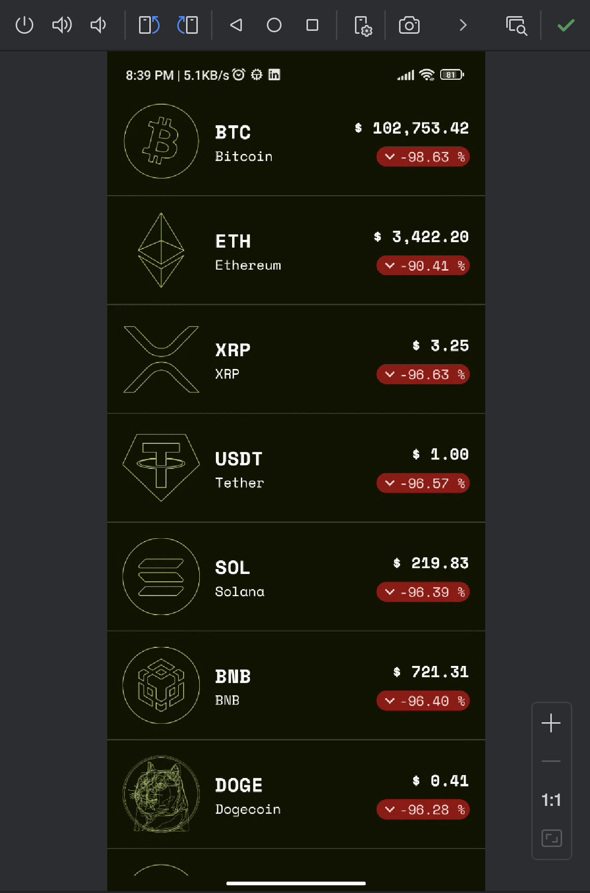
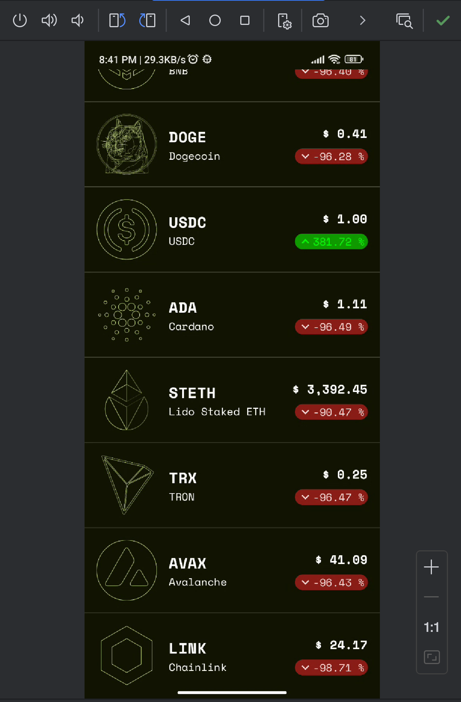
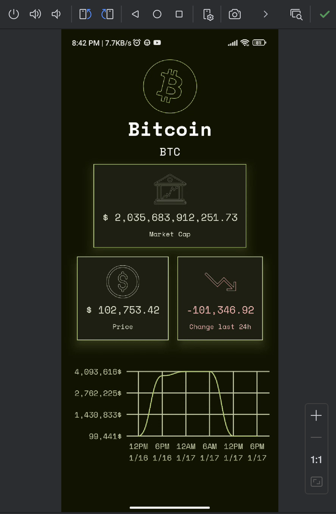
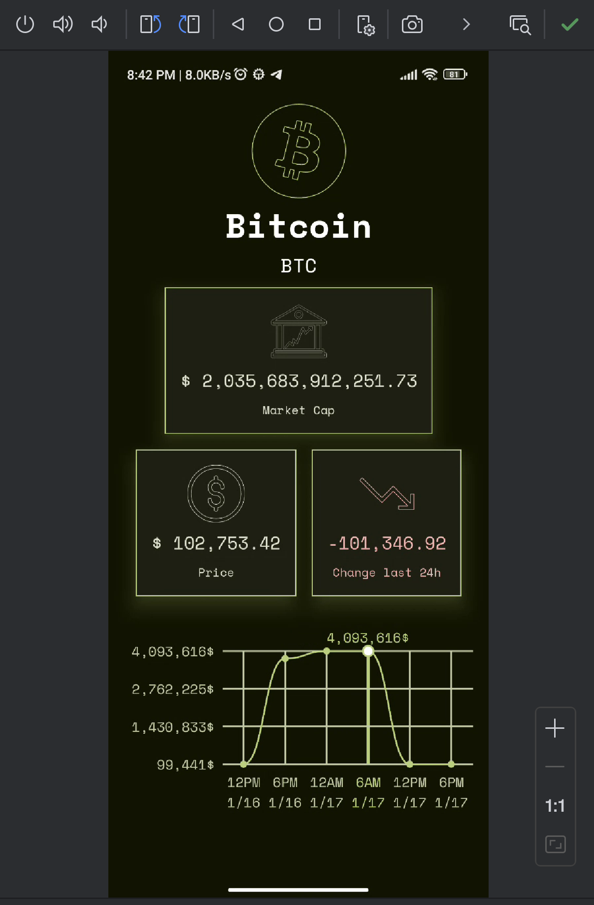
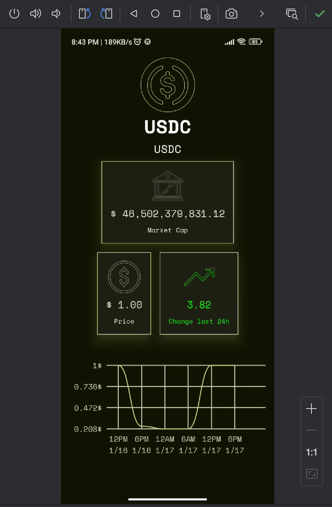
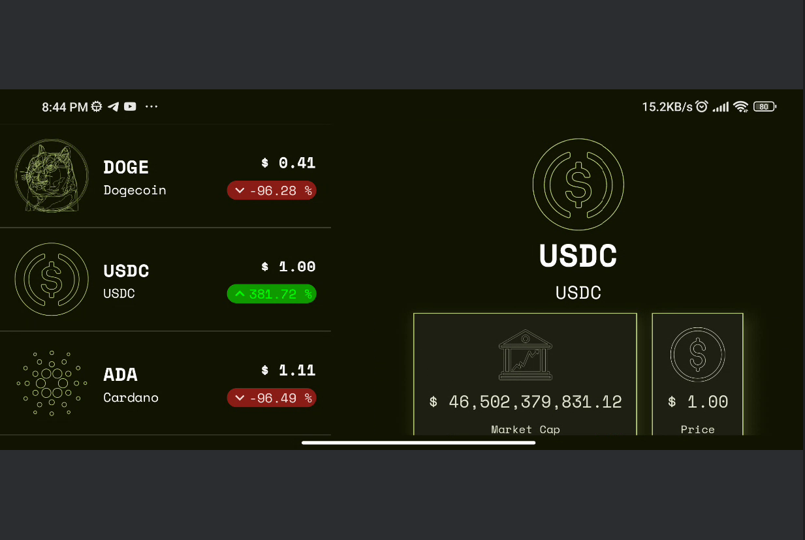
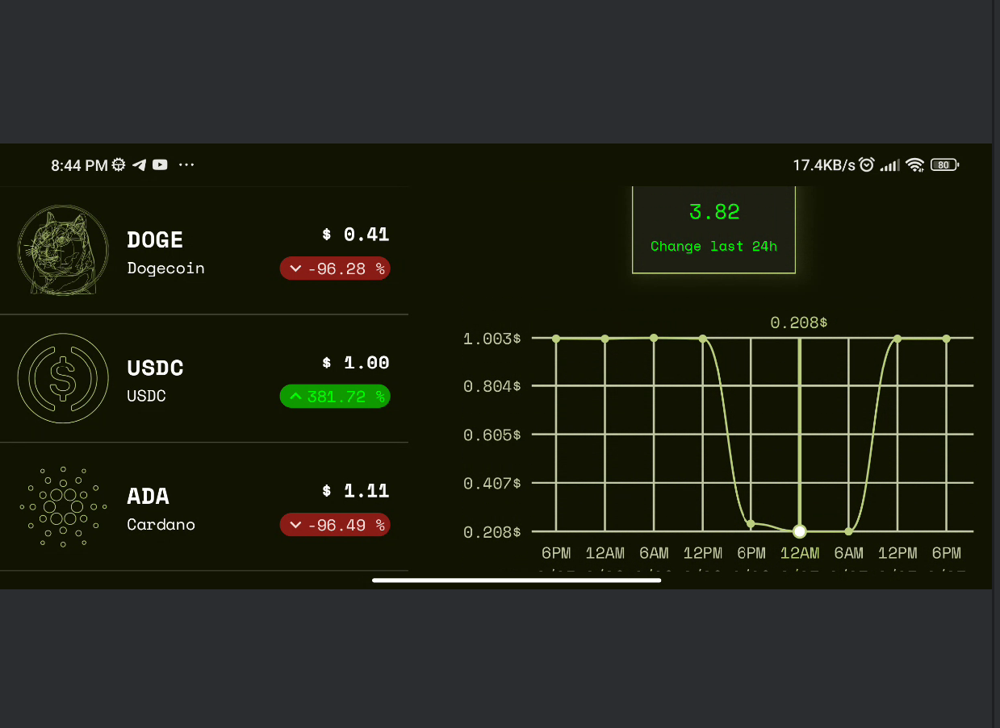

This is an Android app.

# Crypto Tracker

## Features
Crypto Tracker is crypto coin tracking app. You can track crypto coin for free here!

## Screenshots
| Screenshot 1                   | Screenshot 2                   |
|--------------------------------|--------------------------------|
|  |  |

| Screenshot 3                   | Screenshot 4                   | Screenshot 5                   |
|--------------------------------|--------------------------------|--------------------------------|
|  |  |  |

| Screenshot 6                   | Screenshot 7                   |
|--------------------------------|--------------------------------|
|  |  |

## Architecture
This app follows the MVI(Model-View-Intent) architecture design pattern.

## Data Source
All data comes from the CoinCap API 2.0: https://docs.coincap.io/
